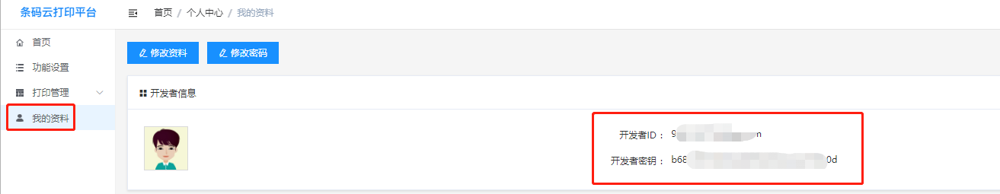
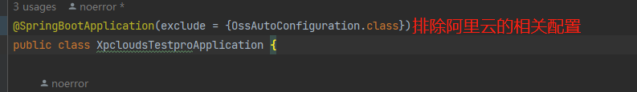

# xpcloudes-opensdk
xp-420b 条码打印机sdk。[产品详细介绍地址](https://www.xpyun.net/product-detail.html?id=1)：https://www.xpyun.net/product-detail.html?id=1 支持打印不干胶标签、各种小票订单。支持打印HTML排版布局订单，pdf文件，图片订单数据，不干胶粘贴标签打印。针对不干胶标签打印采用XML模板化技术，使其排版更简单高效。

## 如何获取开发者信息

登录 [条码云打印机管理后台](https://platform-barcode.xpyun.net/#/login?redirect=%2Fhome)，获取开发者ID和开发者密钥。如下图，点击”我的资料“，即可在左侧看见开发者信息下的开发者ID和开发者密钥。**开发者ID和开发者密钥是保障打印业务稳定可靠的唯一凭证，切勿泄露**



## 如何使用SDK

（1）使用maven创建springboot工程，在pom文件中引入SDK

```xml
<dependency>
    <groupId>io.github.dv996coding</groupId>
    <artifactId>xpclouds-opensdk</artifactId>
    <version>1.0.3</version>
</dependency>
```

（2）在工程的resource的目录下添加相关配置

yaml或yml 格式文件配置。其中oss开头的为阿里云存储配置，默认需要配置的，可以参考后面的说明排除配置文件

```yaml
oss:
  #阿里云OSS服务器，Endpoint以杭州为例，其它Region请按实际情况填写。
  endpoint: http://oss-cn-hangzhou.aliyuncs.com
  #阿里云主账号AccessKey拥有所有API的访问权限，风险很高。强烈建议您创建并使用RAM账号进行API访问或日常运维，请登录RAM控制台创建RAM账号。
  access-key-id: <yourAccessKeyId>
  access-key-secret: <yourAccessKeySecret>
  #存储空间名称
  bucket-name: <yourBucketName>
  #oss外网访问地址映射域名，打印机打印订单时使用
  bind-domain: <yourDomain>
  #订单存储父目录，必须
  prefix: <yourParentDirectory>
  #订单存储父目录下的子目录，当为空值时，所有订单军保存到父目录
  sub-prefix: <yourSubdirectory>
xp:
  dev:
    #调试跟踪模式，默认false关闭  如需要开启设置为true即可
    debug: false
    #开发者密钥，登录芯烨云电子面单打印平台，点击“我的资料”，对应于打开页面的开发者密钥。建议采用粘贴复制方式，操作时确保首尾无空格。否则在开发时会提示验签失败
    user-key: <yourUserKey>
    #开发者ID，注册芯烨云电子面单打印平台提供
    user: <yourUser>
    #接口域名地址，默认国内地址
    domain: https://open-barcode.xpyun.net
logging:
  config: classpath:logback-opensdk.xml #SDK日志输出文件。默认不可更改

```

properties格式文件配置。其中oss开头的为阿里云存储配置，默认需要配置的，可以参考后面的说明排除配置文件

```properties
#阿里云OSS服务器，Endpoint以杭州为例，其它Region请按实际情况填写。
oss.endpoint=http://oss-cn-hangzhou.aliyuncs.com
#阿里云主账号AccessKey拥有所有API的访问权限，风险很高。强烈建议您创建并使用RAM账号进行API访问或日常运维，请登录RAM控制台创建RAM账号。
oss.accessKeyId=<yourAccessKeyId>
oss.accessKeySecret=<yourAccessKeySecret>
#存储空间名称
oss.bucketName=<yourBucketName>
#oss外网访问地址映射域名，打印机打印订单时使用
oss.bindDomain=<yourDomain>
#订单存储父目录，必须
oss.prefix=<yourParentDirectory>
#订单存储父目录下的子目录，当为空值时，所有订单军保存到父目录
oss.subPrefix=<yourSubdirectory>
#开发者ID，注册芯烨云电子面单打印平台提供
xp.dev.user=<yourUser>
#开发者密钥，登录芯烨云电子面单打印平台，点击“我的资料”，对应于打开页面的开发者密钥。建议采用粘贴复制方式，操作时确保首尾无空格。否则在开发时会提示验签失败
xp.dev.userKey=<yourUserKey>
#调试跟踪模式，默认false关闭  如需要开启设置为true即可
xp.dev.debug=false
#接口域名地址，默认国内地址
xp.dev.domain=https://open-barcode.xpyun.net
#SDK日志输出文件。默认不可更改
logging.config=classpath:logback-opensdk.xml
```

（3）程序调用

在需要调用SDK的地方，直接使用 @Resource 注解即可调用，此处以调用printImage接口为例

```java
 @Resource
 private PrintService printService;
```

新建一个测试用例

```java
 @Test
    void testPrintImage() throws IOException {
        String sn = "000xxxxxxx64A";
        String htmlStr=""; //htmlStr标准字符串
        String imageContent = new HtmlToImageUtil(600).getHtml2ImageContent(htmlStr);

        imageContent = imageContent.replace("\\r\\n", "");
        //构造打印接口参数
        PrintOrderRequest printOrderRequest = new PrintOrderRequest(sn, imageContent);
        // 打印纸张宽度，根据实际纸张宽度设置，如80纸张宽度 可以设置为80*8=640
        printOrderRequest.setPaperWidth(600);
        // 增加切刀
        printOrderRequest.setCutter(false);
        //调用打印接口，打印订单数据
        ObjectRestResponse<String> restResponse = printService.printImage(printOrderRequest);
        String str = JSON.toJSONString(restResponse);
        System.out.println(str);
    }
```

更多完整的使用示例，请参见 https://gitee.com/gsocode/xpclouds-testpro

## 如何排除阿里云存储

如果开发者不想使用阿里云存储配置，可以按照以下说明排除阿里云存储配置

（1）pom文件里面需要移除 aliyun-sdk-oss 


```xml
<dependency>
	<groupId>io.github.dv996coding</groupId>
	<artifactId>xpclouds-opensdk</artifactId>
	<version>1.0.3</version>
	<exclusions>
		<exclusion>
			<groupId>com.aliyun.oss</groupId>
			<artifactId>aliyun-sdk-oss</artifactId>
		</exclusion>
	</exclusions>
</dependency>
```

（2）主程序类里面不加载oss相关配置，添加以下注解



```java
@SpringBootApplication(exclude = {OssAutoConfiguration.class})
```

（3）配置文件修改，去除oss相关参数配置

yaml或yml 格式文件配置。其中oss开头的为阿里云存储配置，默认需要配置的，可以参考后面的说明排除配置文件

```yaml
xp:
  dev:
    #调试跟踪模式，默认false关闭  如需要开启设置为true即可
    debug: false
    #开发者密钥，登录芯烨云电子面单打印平台，点击“我的资料”，对应于打开页面的开发者密钥。建议采用粘贴复制方式，操作时确保首尾无空格。否则在开发时会提示验签失败
    user-key: <yourUserKey>
    #开发者ID，注册芯烨云电子面单打印平台提供
    user: <yourUser>
    #接口域名地址，默认国内地址
    domain: https://open-barcode.xpyun.net
logging:
  config: classpath:logback-opensdk.xml #SDK日志输出文件。默认不可更改

```

properties格式文件配置。其中oss开头的为阿里云存储配置，默认需要配置的，可以参考后面的说明排除配置文件

```properties
#开发者ID，注册芯烨云电子面单打印平台提供
xp.dev.user=<yourUser>
#开发者密钥，登录芯烨云电子面单打印平台，点击“我的资料”，对应于打开页面的开发者密钥。建议采用粘贴复制方式，操作时确保首尾无空格。否则在开发时会提示验签失败
xp.dev.userKey=<yourUserKey>
#调试跟踪模式，默认false关闭  如需要开启设置为true即可
xp.dev.debug=false
#接口域名地址，默认国内地址
xp.dev.domain=https://open-barcode.xpyun.net
#SDK日志输出文件。默认不可更改
logging.config=classpath:logback-opensdk.xml
```


